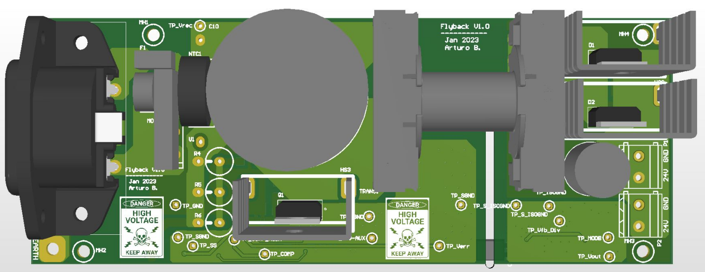
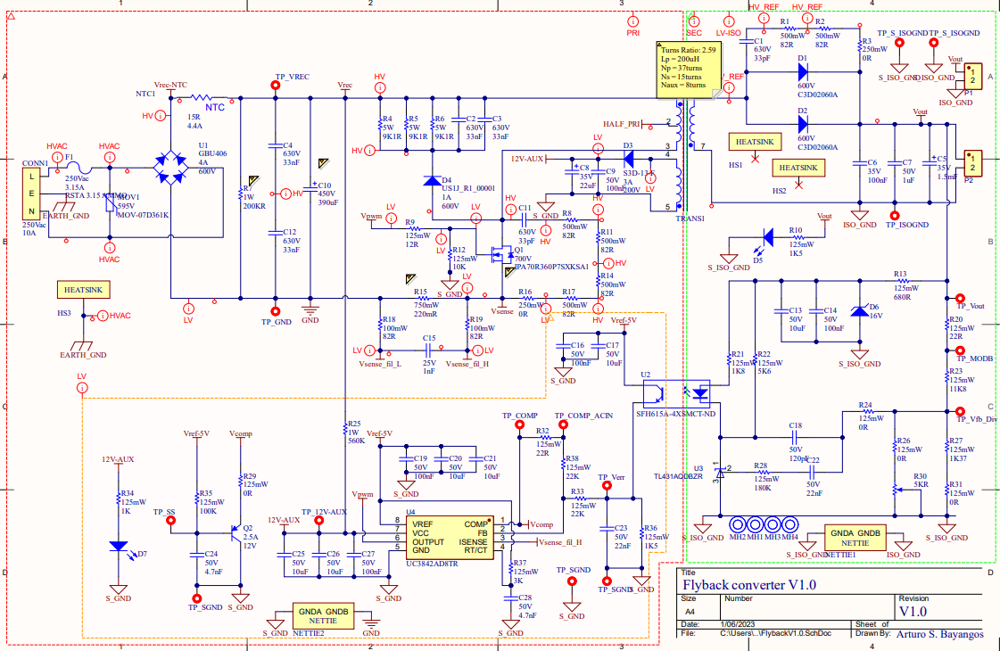
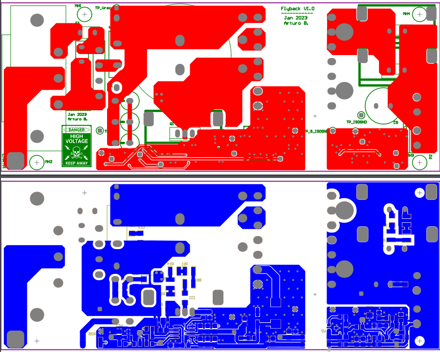

# About
In this project I am designing and building a 60W,20V, dual channel digital power supply. The user will be able to set  the power supply voltage and max current using tactile buttons and an LCD display will show them their inputs as well as the PSU status.

A 150W flyback converter will convert the AC voltage from the grid to a safe DC voltage. Then, two synchronous buck converter will condition the output of the flyback converter at the user’s command which is done in the background with a microcontroller.
# Motivation
I wanted to learn how to design the feedback loop for an isolated power converter which is commonly found on flyback converter. Also, I wanted to learn how to control an LCD using a microcontroller. Finally, even though I have programmed in C before, I have always done it using ATMEL microcontroller. This time I wanted to play around with STM32 or ESP32 microcontrollers.
# Progress and What's coming
* I have designed the first protoype for the flyback converter and have the PCB file ready to be manufacture. However, I am currently too poor to buy the components to assemble it.

* I have started to design the synchronous buck converter. I have gathered enough information to pick the components for the power section. Next I need to think about how I am going to control it, and how I will implement the protection schemes.

* I need to write the code to handle the user inputs and translate them for the buck converter,  and I also need to write the logic to control the LCD display.

* Finally, I need to design an enclosure for the digital power supply.
 
